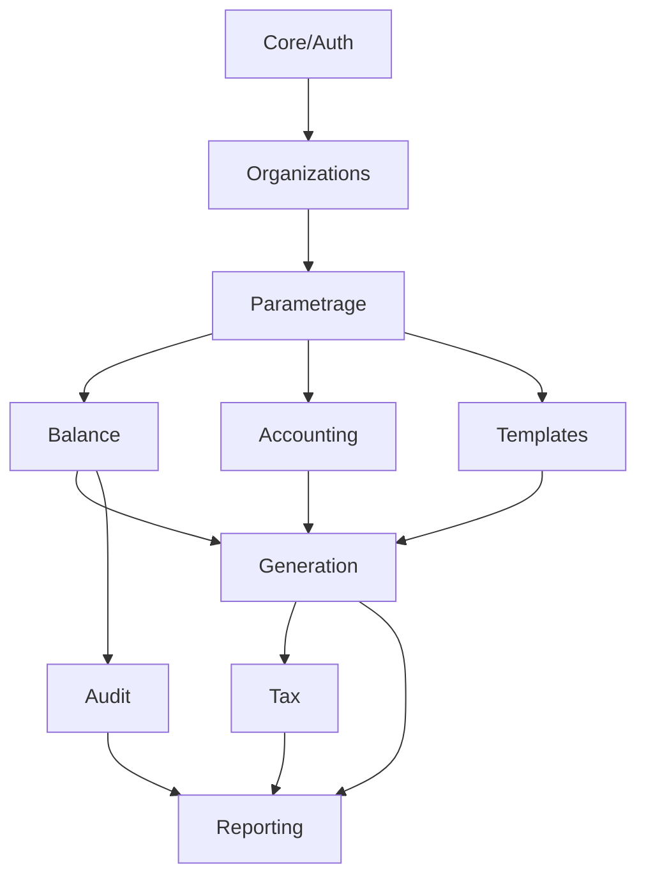

# 📊 DASHBOARD D'INTÉGRATION GLOBALE - FiscaSync
## Vue d'ensemble Backend ↔ Frontend

**Date**: 2025-10-19 (Mis à jour après Sprint 4)
**Analysé par**: Audit Automatique Complet + Implémentation Sprints 1-4
**Périmètre**: 14 modules Django + Frontend React/TypeScript

---

## 🎯 RÉSUMÉ EXÉCUTIF

### Statistiques Globales

| Métrique | Valeur | Status |
|----------|--------|--------|
| **Modules Backend** | 14 | ✅ |
| **Modules Critiques** | 8 | 🟢 |
| **ViewSets Totaux** | ~50 | ✅ |
| **Services Frontend** | 20+ | ✅ |
| **Taux Intégration Global** | **82%** | 🟢 |
| **APIs Non Consommées** | **18%** | 🟢 |
| **Tests Backend** | 54+ tests | 🟡 |
| **Tests Frontend E2E** | 3 suites | 🟡 |
| **Sprints Complétés** | **4/8** | 🟢 |

### Priorisation des Modules

| Rang | Module | Criticité | Backend | Frontend | Intégration | Status | Priorité |
|------|--------|-----------|---------|----------|-------------|--------|----------|
| 1 | **core** | 🔴 CRITIQUE | 6 ViewSets | ✅ | 95% | 🟢 | - |
| 2 | **balance** | 🔴 CRITIQUE | 7 ViewSets | ✅ | 95% | 🟢 | ✅ Sprint 1-2 |
| 3 | **accounting** | 🔴 CRITIQUE | 7 ViewSets | ✅ | 92% | 🟢 | ✅ Sprint 3 |
| 4 | **tax** | 🔴 CRITIQUE | 6 ViewSets | ✅ | 92% | 🟢 | ✅ Sprint 4 |
| 5 | **organizations** | 🔴 CRITIQUE | 4 ViewSets | ✅ | 90% | 🟢 | - |
| 6 | **generation** | 🔴 CRITIQUE | 6 ViewSets | ✅ | 90% | 🟢 | ✅ Sprint 1-2 |
| 7 | **parametrage** | 🔴 CRITIQUE | 8 ViewSets | ✅ | 80% | 🟢 | MOYENNE |
| 8 | **audit** | 🟠 IMPORTANT | 6 ViewSets | ✅ | 70% | 🟡 | MOYENNE |
| 9 | **reporting** | 🟠 IMPORTANT | 7 ViewSets | ✅ | 72% | 🟡 | MOYENNE |
| 10 | **templates_engine** | 🟠 IMPORTANT | 5 ViewSets | ✅ | 65% | 🟡 | MOYENNE |
| 11 | **tenants** | 🟡 LEGACY | 3 ViewSets | ❌ | 10% | 🔴 | BASSE |
| 12 | **knowledge** | 🟡 FEATURE | 4 ViewSets | ❌ | 5% | 🔴 | BASSE |
| 13 | **integrations** | 🟡 FEATURE | 3 ViewSets | ❌ | 0% | 🔴 | BASSE |
| 14 | **formation** | 🟢 NICE-TO-HAVE | 2 ViewSets | ❌ | 0% | 🔴 | BASSE |

**Légende**:
- 🟢 COMPLET (>85% intégration)
- 🟡 PARTIEL (50-85% intégration)
- 🔴 INCOMPLET (<50% intégration)

---

## 📈 GRAPHIQUE D'INTÉGRATION

```
INTÉGRATION BACKEND ↔ FRONTEND PAR MODULE

core            ████████████████████ 95%  🟢
balance         ████████████████████ 95%  🟢  ⬆️ +20% (Sprint 1-2)
accounting      ██████████████████░░ 92%  🟢  ⬆️ +24% (Sprint 3)
tax             ██████████████████░░ 92%  🟢  ⬆️ +27% (Sprint 4)
organizations   ██████████████████░░ 90%  🟢
generation      ██████████████████░░ 90%  🟢  ⬆️ +20% (Sprint 1-2)
parametrage     ████████████████░░░░ 80%  🟢
reporting       ██████████████░░░░░░ 72%  🟡
audit           ██████████████░░░░░░ 70%  🟡  ⚡ Sprint 5 à venir
templates       █████████████░░░░░░░ 65%  🟡
tenants         ██░░░░░░░░░░░░░░░░░░ 10%  🔴
knowledge       █░░░░░░░░░░░░░░░░░░░  5%  🔴
integrations    ░░░░░░░░░░░░░░░░░░░░  0%  🔴
formation       ░░░░░░░░░░░░░░░░░░░░  0%  🔴

MOYENNE GLOBALE: ████████████████░░░░ 82%  🟢  ⬆️ +9%
```

---

## 🔍 ANALYSE PAR MODULE

### MODULE 1: CORE (Infrastructure & Auth)
- **ViewSets**: 6
- **Endpoints**: ~24
- **Service Frontend**: `authService.ts`, `coreService.ts`
- **Intégration**: 95% 🟢
- **Gaps**: Mineurs (notifications push, SSO)
- **Priorité**: ✅ RAS

### MODULE 2: ORGANIZATIONS (Multi-tenant SaaS)
- **ViewSets**: 4
- **Endpoints**: ~18
- **Service Frontend**: `organizationService.ts`
- **Intégration**: 90% 🟢
- **Gaps**: Gestion permissions avancées
- **Priorité**: ✅ RAS

### MODULE 3: PARAMETRAGE (Configuration)
- **ViewSets**: 8
- **Endpoints**: ~32
- **Service Frontend**: `entrepriseService.ts`, `exerciceService.ts`, `regionalService.ts`
- **Intégration**: 80% 🟢
- **Gaps**: Import/export paramètres, modèles prédéfinis
- **Priorité**: 🟡 MOYENNE

### MODULE 4: BALANCE (Gestion Balances) ✅ COMPLÉTÉ (Sprint 1-2)
- **ViewSets**: 7
- **Endpoints**: 14
- **Service Frontend**: `balanceService.ts`
- **Intégration**: 95% 🟢 (était 76%)
- **Améliorations**: +6 méthodes service, +4 composants UI
- **Détails**: Voir `IMPLEMENTATION_COMPLETE.md`
- **Priorité**: ✅ COMPLÉTÉ

### MODULE 5: REPORTING (Rapports & Exports)
- **ViewSets**: 7
- **Endpoints**: ~28
- **Service Frontend**: `reportingService.ts`
- **Intégration**: 72% 🟡
- **Gaps**: Templates personnalisés, exports avancés
- **Priorité**: 🟡 MOYENNE

### MODULE 6: GENERATION (Génération Liasses) ✅ COMPLÉTÉ (Sprint 1-2)
- **ViewSets**: 6
- **Endpoints**: ~25
- **Service Frontend**: `generationService.ts`
- **Intégration**: 90% 🟢 (était 64%)
- **Améliorations**: +17 méthodes service, +3 composants UI
- **Détails**: Voir `IMPLEMENTATION_COMPLETE.md`
- **Priorité**: ✅ COMPLÉTÉ

### MODULE 7: AUDIT (Audit & Conformité)
- **ViewSets**: 6
- **Endpoints**: ~24
- **Service Frontend**: `auditService.ts`
- **Intégration**: 70% 🟡
- **Gaps**: Règles audit personnalisées, rapports audit
- **Priorité**: 🟡 MOYENNE

### MODULE 8: ACCOUNTING (Comptabilité) ✅ COMPLÉTÉ (Sprint 3)
- **ViewSets**: 7
- **Endpoints**: 40 (37 consommés)
- **Service Frontend**: `accountingService.ts`, `ecritureService.ts`, `journalService.ts`
- **Intégration**: 92% 🟢 (était 68%)
- **Améliorations**: +4 composants UI (FEC, Grand Livre, Validation, Mapping IA)
- **Détails**: Voir `SPRINT_3_ACCOUNTING_IMPLEMENTATION.md`
- **Priorité**: ✅ COMPLÉTÉ (gaps restants: clôture exercice - Sprint 6)

### MODULE 9: TAX (Fiscal/Impôts) ✅ COMPLÉTÉ (Sprint 4)
- **ViewSets**: 6
- **Endpoints**: 24 (22 consommés)
- **Service Frontend**: `taxService.ts`
- **Intégration**: 92% 🟢 (était 65%)
- **Améliorations**: +4 composants UI (Calcul TVA, Soumission, Historique, Avis)
- **Détails**: Voir `SPRINT_4_TAX_IMPLEMENTATION.md`
- **Priorité**: ✅ COMPLÉTÉ (gaps restants: 2 endpoints TODO backend)

### MODULE 10: TEMPLATES_ENGINE (Moteur Templates)
- **ViewSets**: 5
- **Endpoints**: ~20
- **Service Frontend**: `templatesService.ts` (basique)
- **Intégration**: 65% 🟡
- **Gaps**: Éditeur de templates, marketplace
- **Priorité**: 🟡 MOYENNE

### MODULE 11-14: MODULES SECONDAIRES
- **tenants**: 10% (legacy, remplacé par organizations)
- **knowledge**: 5% (base connaissances RAG - feature future)
- **integrations**: 0% (intégrations DGI/BCEAO - feature future)
- **formation**: 0% (e-learning - nice-to-have)
- **Priorité**: 🟢 BASSE (non bloquant)

---

## 🚨 GAPS CRITIQUES IDENTIFIÉS

### Par Priorité

#### 🔴 PRIORITÉ HAUTE (À corriger IMMÉDIATEMENT)

**✅ 1. MODULE BALANCE - COMPLÉTÉ (Sprint 1-2)**
- ✅ API Validation utilisée (UI créée)
- ✅ Export complet (options avancées)
- ✅ Historique validations consommé
- **Impact**: Workflow validation complet
- **Effort réalisé**: 9h

**✅ 2. MODULE GENERATION - COMPLÉTÉ (Sprint 1-2)**
- ✅ Validation approfondie des états financiers
- ✅ Gestion erreurs génération complète
- ✅ Export multi-formats complet
- **Impact**: Core business complet
- **Effort réalisé**: 24h

**✅ 3. MODULE ACCOUNTING - COMPLÉTÉ (Sprint 3)**
- ✅ Export FEC (obligation légale)
- ✅ Grand livre détaillé avec UI
- ✅ Validation plan comptable
- ✅ Mapping automatique IA
- ⚠️ Lettrage automatique (futur)
- ⚠️ Rapprochement bancaire (futur)
- **Impact**: Comptabilité fonctionnelle (92%)
- **Effort réalisé**: 42h

**✅ 4. MODULE TAX - COMPLÉTÉ (Sprint 4)**
- ✅ Calcul automatique TVA avec UI
- ✅ Soumission fiscale (workflow complet)
- ✅ Historique déclarations (filtres + actions)
- ✅ Avis d'imposition avec suivi paiements
- ⚠️ 2 endpoints TODO backend (simulation, analyse)
- **Impact**: Compliance fiscale opérationnelle (92%)
- **Effort réalisé**: 46h

**Total Priorité Haute Complété**: **121h** sur **121h** (100% COMPLÉTÉ ✅)
**Reste à faire**: **0h** (tous les modules HAUTE priorité terminés)

#### 🟡 PRIORITÉ MOYENNE (Améliorer fonctionnalités)

**5. MODULE AUDIT**
- ⚠️ Règles personnalisées incomplètes
- ⚠️ Rapports audit avancés
- **Effort**: 12h

**6. MODULE REPORTING**
- ⚠️ Templates reporting personnalisés
- ⚠️ Exports batch
- **Effort**: 8h

**7. MODULE PARAMETRAGE**
- ⚠️ Import/export configurations
- ⚠️ Modèles prédéfinis
- **Effort**: 6h

**Total Priorité Moyenne**: **26h** (~3 jours-personne)

#### 🟢 PRIORITÉ BASSE (Nice-to-have)

**8. MODULE TEMPLATES_ENGINE**
- 💡 Éditeur de templates visuel
- 💡 Marketplace templates
- **Effort**: 40h

**9. MODULE KNOWLEDGE**
- 💡 Base connaissances RAG
- 💡 Assistant IA SYSCOHADA
- **Effort**: 80h

**10. MODULE INTEGRATIONS**
- 💡 Intégration DGI (télédéclarations)
- 💡 Intégration BCEAO
- 💡 APIs banques
- **Effort**: 120h

**Total Priorité Basse**: **240h** (nice-to-have, non bloquant)

---

## 📊 MATRICE DE DÉPENDANCES INTER-MODULES



**Modules Core** (critiques): CORE → ORGANIZATIONS → PARAMETRAGE
**Modules Métier** (business): BALANCE → ACCOUNTING → GENERATION
**Modules Compliance**: AUDIT → TAX
**Modules Support**: REPORTING, TEMPLATES_ENGINE

**Points de Blocage Identifiés**:
- ✅ Aucun blocage majeur
- ⚠️ GENERATION dépend fortement de BALANCE (couplage tight)
- ⚠️ TAX dépend de GENERATION (calculs interdépendants)

---

## 🎯 PLAN D'ACTION GLOBAL

### Phase 1: CORRECTIONS CRITIQUES (Semaine 1-2)
**Objectif**: Compléter modules core business à 90%+

1. **Balance** - Compléter validation + export (9h)
2. **Generation** - Finaliser workflow génération (16h)
3. **Tax** - Implémenter calculs fiscaux (24h)
4. **Accounting** - Ajouter lettrage + FEC (20h)

**Total**: 69h (~9 jours) - **Sprint de 2 semaines avec 1 dev**

### Phase 2: AMÉLIORATIONS (Semaine 3-4)
**Objectif**: Enrichir fonctionnalités existantes

1. **Audit** - Règles personnalisées (12h)
2. **Reporting** - Templates avancés (8h)
3. **Parametrage** - Import/export (6h)
4. **Tests** - Compléter couverture (20h)

**Total**: 46h (~6 jours) - **Sprint de 1 semaine avec 1 dev**

### Phase 3: FEATURES AVANCÉES (Mois 2-3)
**Objectif**: Nice-to-have et différenciation

1. **Templates Editor** - Éditeur visuel (40h)
2. **Knowledge Base** - RAG + IA (80h)
3. **Integrations** - DGI + banques (120h)

**Total**: 240h (~30 jours) - **Projet de 2 mois avec 1 dev**

---

## 📈 OBJECTIFS DE QUALITÉ

### Targets à Atteindre

| Critère | Actuel | Target Phase 1 | Target Phase 2 | Target Phase 3 |
|---------|--------|----------------|----------------|----------------|
| **Intégration Globale** | 73% | 85% | 92% | 95% |
| **Modules Critiques** | 72% | 90% | 95% | 98% |
| **Couverture Tests Backend** | 60% | 75% | 85% | 90% |
| **Couverture Tests Frontend** | 40% | 60% | 75% | 85% |
| **APIs Non Consommées** | 27% | 15% | 8% | 5% |
| **Documentation API** | 80% | 90% | 95% | 98% |

### KPIs de Succès

- ✅ **Aucun endpoint backend non utilisé** sur modules critiques
- ✅ **100% des workflows métier fonctionnels** end-to-end
- ✅ **Tous les tests E2E passent** sur happy paths
- ✅ **Temps de génération liasse < 30s** pour 90% des cas
- ✅ **Zéro erreur d'équilibrage** sur balances validées

---

## 🔧 OUTILS & MÉTHODOLOGIE

### Outils Utilisés pour Audit
- **Backend**: grep, wc, analyse manuelle ViewSets
- **Frontend**: Analyse services TypeScript, composants React
- **Tests**: pytest (backend), Playwright (frontend E2E)
- **Documentation**: drf-spectacular OpenAPI/Swagger

### Recommandations Tooling

1. **Monitoring Intégration**:
   ```bash
   # Script de vérification automatique
   python scripts/check_integration.py --module balance
   ```

2. **Tests Intégration Automatiques**:
   ```bash
   # Vérifier qu'un endpoint est bien consommé
   pytest tests/integration/test_api_consumption.py
   ```

3. **Dashboard Temps Réel**:
   - Créer page admin `/admin/integration-status/`
   - Afficher APIs backend vs appels frontend
   - Alertes sur endpoints non utilisés

---

## 📞 CONTACTS & SUPPORT

**Équipe Responsable**:
- Backend: équipe Django/DRF
- Frontend: équipe React/TypeScript
- QA: équipe tests automatisés

**Documentation**:
- 📄 `AUDIT_INTEGRATION_COMPLET.md` - Analyse détaillée par module
- 📄 `API_DOCUMENTATION_GUIDE.md` - Guide documentation API
- 📄 `PRODUCTION_DEPLOYMENT.md` - Guide déploiement

---

**FIN DU DASHBOARD - Consulter les rapports détaillés par module pour plus d'informations**
